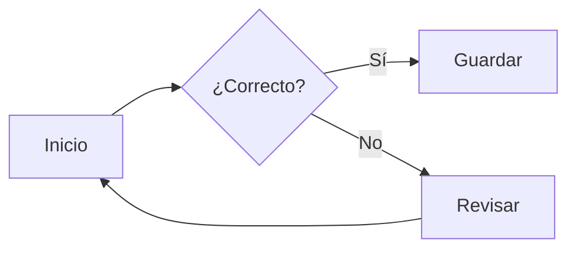
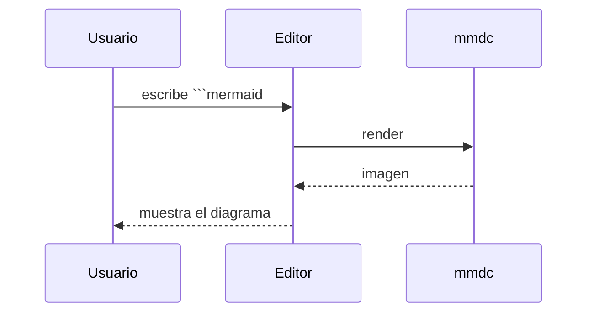

# Diagramas

Los bloques de código ` ```mermaid ` y ` ```plantuml ` se previsualizan como una
imagen **justo debajo** del bloque. El código sigue editable y el Markdown
guardado no cambia (la imagen es solo presentación). Necesitas la herramienta
instalada: `plantuml` (con Java) o `mmdc` (mermaid-cli, con Node). Si falta, el
bloque se queda como código y un aviso te lo dice.

## PlantUML

Diagrama de secuencia:

```plantuml
Alice -> Bob: Solicitud
Bob --> Alice: Respuesta
Alice -> Bob: Otra vez
```

Diagrama de clases:

```plantuml
class Documento {
  +cargar()
  +guardar()
}
class Editor
Editor --> Documento
```

## Mermaid

Diagrama de flujo:



Diagrama de secuencia:



## Lo que NO es un diagrama

Un bloque de código normal se resalta como código, sin previsualización:

```python
def hola():
    print("Hola, mundo")
```
