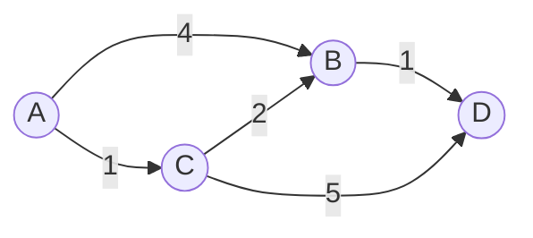
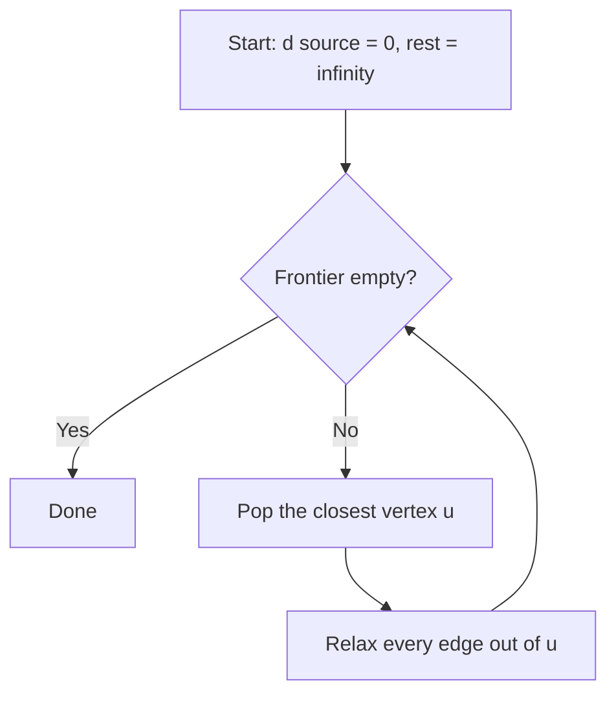

# Dijkstra's shortest-path algorithm 🗺

Given a graph with **non-negative** edge weights, Dijkstra's algorithm finds the
cheapest route from one source vertex to every other vertex. It is the engine
behind route planners, network routing and pathfinding in games.

> [!NOTE]
> The single rule at the heart of the algorithm is *relaxation*: whenever a
> shorter way to reach $v$ is found through $u$, lower the recorded distance.
>
> $$d[v] \leftarrow \min(d[v],\; d[u] + w(u, v))$$

## A worked graph

Take this small weighted graph. The shortest path from **A** to **D** is
`A → C → B → D` with total cost $1 + 2 + 1 = 4$, beating the direct `A → B → D`
(cost $5$):



## How it runs

The algorithm keeps a frontier of vertices ordered by tentative distance, always
expanding the closest one first:



## Implementation

A binary heap keeps the "closest unvisited vertex" lookup cheap:

```python
import heapq

def dijkstra(graph, source):
    """graph: {u: [(v, weight), ...]}.  Returns dist: {vertex: cost}."""
    dist = {source: 0}
    frontier = [(0, source)]               # (distance, vertex) min-heap

    while frontier:
        d, u = heapq.heappop(frontier)
        if d > dist.get(u, float("inf")):
            continue                       # stale entry, skip
        for v, w in graph[u]:
            nd = d + w
            if nd < dist.get(v, float("inf")):
                dist[v] = nd               # relax
                heapq.heappush(frontier, (nd, v))
    return dist
```

The same idea in C++ leans on `std::priority_queue`:

```cpp
using Edge = std::pair<int, int>;          // (vertex, weight)

std::vector<long> dijkstra(const std::vector<std::vector<Edge>>& g, int src) {
    std::vector<long> dist(g.size(), LONG_MAX);
    std::priority_queue<Edge, std::vector<Edge>, std::greater<>> pq;
    dist[src] = 0;
    pq.push({0, src});
    while (!pq.empty()) {
        auto [d, u] = pq.top(); pq.pop();
        if (d > dist[u]) continue;         // stale
        for (auto [v, w] : g[u])
            if (d + w < dist[v])
                pq.push({dist[v] = d + w, v});
    }
    return dist;
}
```

> [!TIP]
> With a binary heap the cost is $O((V + E)\log V)$. Swapping in a
> Fibonacci heap drops it to $O(E + V\log V)$ in theory, though the
> constant factors rarely pay off in practice.

## Choosing the right algorithm

| Algorithm     | Weights        | Complexity            | Best for                 |
|:--------------|:--------------:|:----------------------|:-------------------------|
| BFS           | unweighted     | $O(V + E)$            | shortest *hops*          |
| **Dijkstra**  | non-negative   | $O((V+E)\log V)$      | single source, one graph |
| Bellman–Ford  | any            | $O(V \cdot E)$        | graphs with negative edges |
| A\*           | non-negative   | $O((V+E)\log V)$      | one target + a heuristic |

> [!WARNING]
> Dijkstra is **wrong** on graphs with negative edges: once a vertex is settled
> it is never revisited, so a later, cheaper path through a negative edge is
> missed. Use Bellman–Ford[^bf] there instead.

## Checklist for a robust implementation

- [x] Use a priority queue, not a linear scan
- [x] Skip stale heap entries (`d > dist[u]`)
- [ ] Reconstruct the actual path, not just the cost
    - [x] Store a `prev[]` predecessor map
    - [ ] Walk it back from target to source
- [ ] Handle disconnected vertices (distance stays $\infty$)

[^bf]: Bellman–Ford relaxes *every* edge $V - 1$ times, which is why it tolerates
negative weights and even detects negative cycles.
