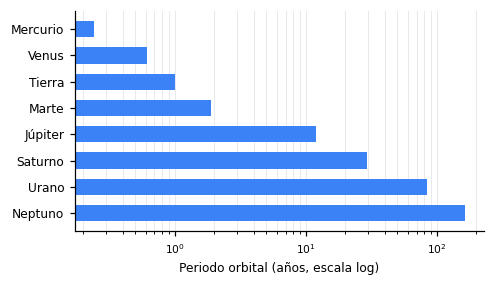

# Mecánica orbital del Sistema Solar ☄

La gravedad $F = G m_1 m_2 / r^2$ gobierna las órbitas, y la **tercera ley de
Kepler** relaciona el periodo $T$ con el semieje mayor $a$ de forma *sorprendentemente* simple:

$$T^2 = \frac{4\pi^2}{GM} a^3$$

Una sola función basta para estimar el periodo[^au] de cualquier órbita:

```python
from math import pi, sqrt

G, M = 6.674e-11, 1.989e30         # SI · masa del Sol
def periodo(a_m):                  # semieje mayor en metros
    return 2 * pi * sqrt(a_m**3 / (G * M))

print(periodo(1.496e11) / 86_400)  # Tierra → ≈ 365 días
```



---

| Cuerpo  | Símbolo | Relación clave                       |
|---------|:-------:|--------------------------------------|
| Sol     |    ☉    | $M \approx 1.99 \times 10^{30}$ kg   |
| Tierra  |    ⊕    | $g = \frac{G M_\oplus}{R_\oplus^2}$  |
| Júpiter |    ♃    | $T \propto a^{3/2}$                  |
| Cometa  |    ☄    | $v = \sqrt{\frac{G M}{r}}$           |

### Verificación del modelo

- [x] Derivar la relación $T^2 \propto a^3$
- [ ] Contrastar con efemérides reales
    - [x] Cargar datos del JPL Horizons
    - [ ] Error relativo por debajo del 1 % en los 8 planetas

[^au]: 1 UA ≈ 149,6 millones de km (la distancia media Tierra–Sol).
