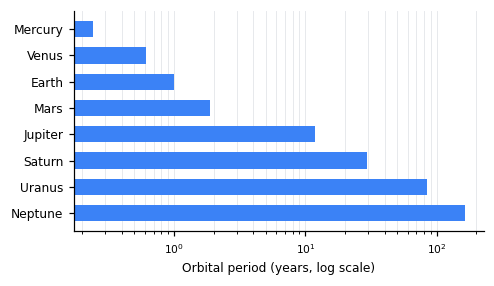

# Orbital mechanics of the Solar System ☄

Every planet, moon and comet traces its path under a single rule: gravity
$F = G\,m_1 m_2 / r^2$ pulls two bodies together, and the balance between that
pull and the body's own motion fixes the shape of the orbit — an *ellipse* with
the Sun at one focus.

> [!NOTE]
> These are **two-body** approximations. They predict the planets to within a
> fraction of a percent, but the real Solar System is a many-body problem: the
> giants perturb each other over millennia.

## Kepler's three laws

**Kepler's third law** relates the orbital period $T$ to the semi-major axis $a$
in a surprisingly simple way:

$$T^2 = \frac{4\pi^2}{GM}\,a^3$$

The *vis-viva* equation gives the speed $v$ at any distance $r$ along the orbit:

$$v = \sqrt{GM\left(\frac{2}{r} - \frac{1}{a}\right)}$$

And the orbit itself is a conic section, its eccentricity $e = \sqrt{1 - b^2/a^2}$
setting how far it strays from a circle:

$$r = \frac{a\,(1 - e^2)}{1 + e\cos\theta}$$

## Estimating a period in code

A single function is enough to estimate the period[^au] of any orbit from its
semi-major axis:

```python
from math import pi, sqrt

G, M = 6.674e-11, 1.989e30          # SI · mass of the Sun
def period(a_m: float) -> float:    # semi-major axis in metres
    """Orbital period in seconds (Kepler's third law)."""
    return 2 * pi * sqrt(a_m**3 / (G * M))

print(period(1.496e11) / 86_400)    # Earth → ≈ 365 days
print(period(7.78e11)  / 86_400)    # Jupiter → ≈ 4 332 days
```



> [!TIP]
> Double-click any formula above to reopen the editor with it pre-loaded, and
> try **Ctrl + scroll** — the 2-D layout scales with the zoom.

## A field guide to the bodies

| Body    | Symbol | Key relation                         |
|---------|:------:|--------------------------------------|
| Sun     |   ☉    | $M \approx 1.99 \times 10^{30}$ kg   |
| Earth   |   ⊕    | $g = \frac{G M_\oplus}{R_\oplus^2}$  |
| Jupiter |   ♃    | $T \propto a^{3/2}$                  |
| Halley  |   ☄    | $v = \sqrt{\frac{G M}{r}}$ at perihelion |

The first column is left-aligned and the symbol column centered — the editor
keeps those `:--` / `:-:` markers when it saves.

## Model verification

- [x] Derive the relation $T^2 \propto a^3$
- [x] Reproduce Earth's period to within 1 %
- [ ] Cross-check against real ephemerides
    - [x] Load JPL Horizons data
    - [ ] Relative error below 1 % for all eight planets
- [ ] Add perturbation terms for Jupiter and Saturn

> [!WARNING]
> The vis-viva equation assumes a **closed** orbit ($a > 0$). For a comet on an
> escape trajectory ($e \ge 1$) the semi-major axis is undefined and the formula
> breaks down — use the energy form instead.

[^au]: 1 AU ≈ 149.6 million km, the mean Earth–Sun distance. A body one AU from
the Sun completes its orbit in one year, by definition.
