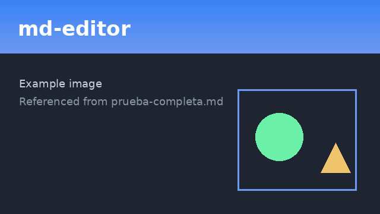

# Complete test document

This file gathers **every** construct the editor can render, edit and
serialize. Use it to check at a glance that the Markdown round-trip, the
themes, the export and the formulas all work — and that the known edge cases
behave as expected.

## 1. Headings

# Heading level 1
## Heading level 2
### Heading level 3
#### Heading level 4
##### Heading level 5
###### Heading level 6

> The outline panel (TOC) should show this whole hierarchy.

## 2. Emphasis and character marks

Plain text, *italic*, **bold**, ***bold and italic***, `inline code`,
~~strikethrough~~ and a combination of **bold with `code` inside**.

Also links inside a sentence: visit the [Markdown site](https://commonmark.org)
for more detail, or write an automatic URL <https://example.com>.

## 3. Paragraphs and line breaks

This is a long paragraph to check line wrapping and the centered column of the
distraction-free mode. Lorem ipsum dolor sit amet, consectetur adipiscing elit,
sed do eiusmod tempor incididunt ut labore et dolore magna aliqua.

A line with a forced break at the end  
and its continuation on the next line.

## 4. Lists

### Unordered

- First item
- Second item
  - Nested subitem
  - Another subitem
    - Third level
- Third item

### Ordered

1. Step one
2. Step two
   1. Substep a
   2. Substep b
3. Step three

### Task list

- [x] Completed task (click to check/uncheck)
- [ ] Pending task
- [ ] Another pending task
  - [x] Done subtask
  - [ ] Pending subtask

## 5. Block quotes

> This is a simple quote.
>
> > And this is a quote nested inside another.
>
> — with attribution at the end.

## 6. Code blocks

Code with no language:

```
plain text without highlighting
second line
```

With syntax highlighting (C++):

```cpp
#include <iostream>

int main() {
    std::cout << "Hello, world\n";
    return 0;
}
```

Python:

```python
def greeting(name: str) -> str:
    return f"Hello, {name}"

print(greeting("world"))
```

JavaScript:

```javascript
const sum = (a, b) => a + b;
console.log(sum(2, 3));
```

## 7. Tables (with alignments)

| Product       | Quantity | Price  |
|:--------------|:--------:|-------:|
| Apples        |    10    |  $3.50 |
| Pears         |     5    |  $2.00 |
| Bananas       |    20    |  $6.75 |
| **Total**     |    35    | $12.25 |

The first column is left-aligned, the second centered and the third
right-aligned. The editor must keep the `:--`, `:-:` and `--:` markers on save.

## 8. Horizontal rule

The next element is a horizontal rule:

---

And we carry on after the rule.

## 9. Images



> If you paste an image from the clipboard, it should be saved as a PNG next to
> this file and inserted as ``.

## 10. TeX formulas

### Inline

Euler's famous identity is $e^{i\pi} + 1 = 0$, and the area of a circle is
$A = \pi r^2$. A subscript and superscript together: $x_i^2$.

### Block

Summation:

$$\sum_{i=1}^{n} i = \frac{n(n+1)}{2}$$

Integral:

$$\int_{0}^{\infty} e^{-x^2}\,dx = \frac{\sqrt{\pi}}{2}$$

Greek letters and sets: $\alpha, \beta, \gamma, \Delta, \Omega$ and
$\mathbb{R} \subset \mathbb{C}$.

Root and fraction: $\sqrt{a^2 + b^2}$ and $\frac{1}{1 + x}$.

## 11. Footnotes

Here is a claim with a footnote[^1] and another one further on[^note].

[^1]: This is the first footnote.
[^note]: Footnotes can have a named label instead of a number.

## 12. Special characters and escaping

Symbols that must survive the round-trip: \* \_ \` \# \\ and entities like
&amp;, &lt;, &gt;. Curly “quotes”, em dash —, ellipsis…

Emoji and Unicode symbols: ★ ☂ → ≠ ≤ ≥ ∞ ✓ ✗ 😀 (to test LaTeX export).

## 13. Edge cases

These deliberately push the limits described in the project notes. Some are
**known limitations** and are expected to look imperfect.

### 13.1 Table without alignment markers

Qt drops alignment on save; a table with no `:` markers should round-trip as a
plain left-aligned table:

| Key   | Value |
|-------|-------|
| host  | local |
| port  | 8080  |

### 13.2 Table with inline formatting and escaped pipes

| Feature   | Status      | Note                    |
|-----------|-------------|-------------------------|
| *Italic*  | **done**    | works in cells          |
| `code`    | done        | a literal pipe: `a \| b` |
| Link      | done        | [link](https://x.test)  |

### 13.3 Code with characters that can break highlighting

```cpp
// strings with quotes, backslashes and comment-like tokens
const char* s = "a \"quoted\" string with /* not a comment */ and \\ backslash";
auto r = R"(raw string with ``` backticks and $not_math$ inside)";
int shift = 1 << 3;  // operators: && || == != <= >=
```

A fenced block that itself contains triple backticks (closed with four):

````markdown
```cpp
int x = 0;
```
````

### 13.4 Multiline display formula (known limitation)

`findMath` works line by line, so a `$$…$$` spanning several source lines is
**not** detected and should appear as literal text:

$$
\begin{aligned}
a &= b + c \\
  &= d
\end{aligned}
$$

The single-line form below, by contrast, must render correctly:

$$a = b + c = d$$

### 13.5 Nested and mixed list markers

1. Ordered parent
   - Unordered child
     1. Ordered grandchild
   - [ ] Task inside an ordered list
2. Back to ordered
   > A quote nested inside a list item.

### 13.6 Tight vs. loose lists

Tight:

- one
- two
- three

Loose (blank lines between items):

- one

- two

- three

### 13.7 Long inline code and a very long unbroken URL

`this_is_a_very_long_identifier_that_should_not_wrap_in_the_middle_of_a_token_abcdefghijklmnop`

<https://example.com/very/long/path/that/keeps/going/and/going/to/test/horizontal/overflow/handling?query=1&more=2>

### 13.8 Empty and whitespace-only constructs

An empty list item:

-

A heading immediately followed by a rule:

### Tiny heading
---

## 14. Closing text

If everything above looks right in the WYSIWYG view, edits without losing
formatting, and saving then reopening the file changes nothing, the round-trip
works. Check it also in **split view** and in **source view**.
