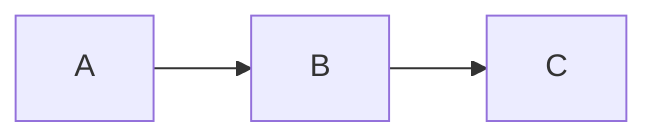

# 一页看懂 Markdown

**Markdown** 是一种用简单符号为文本设置格式的写法。左边是你输入的内容，右边是它
显示出来的样子。在 md-editor 里你不需要亲手敲这些符号：用工具栏设置格式，保存时
编辑器会替你生成它们。

## 目录

- [段落与换行](#段落与换行)
- [标题](#标题)
- [强调](#强调)
- [列表](#列表)
- [引用](#引用)
- [代码](#代码)
- [链接与图片](#链接与图片)
- [脚注](#脚注)
- [水平分隔线](#水平分隔线)
- [表格](#表格)
- [数学公式](#数学公式)
- [md-editor 支持的扩展](#md-editor-支持的扩展)
- [Front matter](#front-matter)
- [转义](#转义)

## 段落与换行

段落之间用一个**空行**分隔。在同一段落内，行尾加两个空格可以强制换行，而不会另起
一个新段落。

## 标题

```
# 一级标题
## 二级标题
### 三级标题
```

最多六级（`######`）。在 md-editor 里也可以用**格式 → 标题**，或按 Ctrl+1 … Ctrl+6。

## 强调

- `*斜体*` 或 `_斜体_` → *斜体*
- `**粗体**` 或 `__粗体__` → **粗体**
- `***粗斜体***` → ***粗斜体***
- `~~删除线~~` → ~~删除线~~

## 列表

**项目符号**（用 `-`、`*` 或 `+`）：

```
- 苹果
- 梨
  - 香梨
  - 雪梨
```

**编号列表**：

```
1. 第一
2. 第二
3. 第三
```

**任务**（复选框）：

```
- [x] 已完成
- [ ] 待办
```

## 引用

一行或多行，前面加 `>`：

```
> 读万卷书，行万里路。
> — 刘彝
```

## 代码

**行内代码**：用反引号括起来：`` `代码` ``。

**代码块**：首尾各三个反引号；还可以写上语言名称来着色：

````
```python
def saluda(nombre):
    print(f"你好，{nombre}")
```
````

## 链接与图片

- **链接**：`[文字](https://example.com)`
- **带标题的链接**：`[文字](https://example.com "悬停标题")`
- **图片**：`` — 和链接一样，只是前面多一个 `!`。

在 md-editor 里，**Ctrl+单击**链接会用浏览器打开它。

## 脚注

正文里的**引用标记**和另起一处的**定义**，靠标识符 `[^id]` 相连：

```
一个需要补充说明的论断[^1]。

[^1]: 脚注的正文写在这里。
```

`id` 可以是数字（`[^1]`），也可以是单词（`[^note]`）。在 md-editor 里，**插入 →
脚注**（Ctrl+Shift+N）会替你创建引用标记及其定义；引用标记显示为上标，单击即可跳转
到定义处。

## 水平分隔线

单独一行里写三个或更多的连字符、星号或下划线：

```
---
```

## 表格

```
| 商品 | 数量 | 价格 |
|------|-----:|:----:|
| 面包 |    2 | 1.20 |
| 牛奶 |    1 | 0.95 |
```

分隔行里的冒号决定该列的对齐方式：`:--` 左对齐，`:-:` 居中，`--:` 右对齐。
md-editor 在保存时会保留对齐方式。

## 数学公式

标准 Markdown **没有**定义公式，但有一种非常通行的约定（Pandoc、Obsidian、Quarto、
GitHub），md-editor 也支持：把 TeX 语法写在 `$...$`（行内）和 `$$...$$`（块级）之间。

```
公式 $E = mc^2$ 非常有名。

$$
\sum_{i=1}^n a_i = \frac{n(n+1)}{2}
$$
```

公式里的 TeX 特殊字符（`\`、`_`、`*`、`{`、`}`）会原样保留 —— 编辑器会保护它们，
以免 Markdown 解析器把它们当成斜体或粗体。

在 md-editor 里，公式会以真正的上标和下标渲染出来（而不是显示为字面的 `$x^2$`）。
用**插入 → 公式…**（Ctrl+Shift+F）插入公式，或者双击已有的公式来编辑它。

## md-editor 支持的扩展

除了以上这些标准 Markdown 之外，md-editor 还认识四种非常通行的约定。它们不属于最初
的 Markdown，所以别的编辑器可能会把它们显示为字面文本；不过文件本身会原样保存，什么
也不会丢。

**高亮**（GitHub/Obsidian 风格）：两侧各两个等号。

```
这段文字会像用荧光笔一样 ==高亮显示==。
```

**上标和下标**（Pandoc 风格）：脱字符和波浪号。

```
面积是 12 m^2^，水的化学式是 H~2~O。
```

**警示块**（GitHub 风格）：首行是方括号标签的引用块。可用的标签有 `[!NOTE]`、
`[!TIP]`、`[!IMPORTANT]`、`[!WARNING]` 和 `[!CAUTION]`。

```
> [!WARNING]
> 这一步会删除之前的数据。
```

**图表**：语言为 `mermaid` 或 `plantuml` 的代码块。如果装有相应的工具，编辑器会在代码
块下方把它预览为图片。

````

````

## Front matter

许多站点生成器（Jekyll、Hugo、Quarto…）会在文件开头放一段元数据，用 `---`（YAML）
或 `+++`（TOML）括起来：

```
---
title: 年度报告
lang: zh
---
```

md-editor 在保存时会**原样**保留它：它不参与编辑，在编辑器里也看不到。导出时的
`title` 和 `lang`，以及拼写检查所用的词典，都是从这里取的。

## 转义

要让某个 Markdown 符号按字面显示（不当作格式），在它前面加一个反斜杠：
`\*这不是斜体\*` → \*这不是斜体\*。

可以转义的符号有：
```
\ ` * _ { } [ ] ( ) # + - . ! |
```
